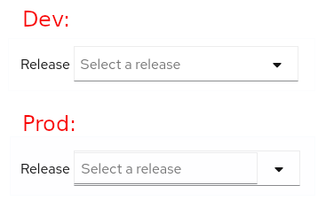

> This repo is based on [patternfly/patternfly-react-seed](https://github.com/patternfly/patternfly-react-seed).

It only adds a `Typeahead Select` component to exemplify that the styles created by the production build have a different order than in development. See the image bellow:

## How to reproduce the issue?
1. `yarn start` - everything should look properly styled
2. `yarn build` and open `dist/index.html` in the browser - Typeahead Select styles are different from step 1.
